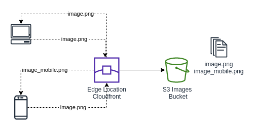

Se suas aplicações não são API-only e possuem uma interface web, seguramente você utiliza direta ou indiretamente algum _Content Delivery Network_ (CDN) para distribuir arquivos para o navegador. Na AWS o serviço gerenciado de CDN é chamado **Cloudfront** e uma das funcionalidades que esse serviço tem - e que é tópico desse post - é **Cloudfront Function**. Essa funcionalidade é bastante útil, nesse post vou mostrar como implementar uma otimização de entrega de imagens para sua aplicação utilizando ela.

## O que são Cloudfront Functions?

Cloudfront Function permite executar funções javascript leves nas _edge locations_ do CDN. Através dessa função é possível manilupar aspectos da requisição e resposta do Cloudfront, como adicionar headers, trocar a URI e etc. Ela faz isso de maneira bastante performática (tem alta escala e baixa latência) por ser apenas uma função js leve.

Casos de uso comuns para a utilização das **_Cloufront functions_** são:

- Manipulação e normalização das chaves do cache;
- **Reescrita e redirecionamento de URLs**;
- Manipulação de cabeçalhos;
- Autorização de acesso.

### Diferença em relação à Lambda@edge

O Cloudfront também tem uma funcionalidade parecida que se chama Lambda@edge. A Lambda@edge foi criada em 2017, alguns anos antes que as Cloudfront Functions. As 2 funcionalidades são diferentes e tem casos de uso diferentes, por isso é importante reconhecer quando utilizar uma ou outra.

As pricipais diferenças entre essas 2 funcionalides são as seguintes:

| -           | Cloudfront Function          | Lambda@Edge                   |
| ----------- | ---------------------------- | ----------------------------- |
| Runtime     | Apenas JS                    | Javascript e Python           |
| Computação  | Baseada em processo          | Baseada em VM                 |
| Performance | Alta escala e Baixa latência | Milhares de req/s             |
| Localização | Edge (218+) lugares          | Edge regional (13)            |
| Acessos     | Nenhum                       | Serviços aws, filesystem, etc |
| Req. Body   | Não                          | Sim                           |

Essa tabela pode ser usada de referência para escolher entre elas. Em resumo, usamos _cloudfront function_ quando queremos alguma manipulação simples de URI, header ou algum aspecto dessa parte da requisição e usaremos Lambda@edge quando precisarmos fazer algo mais elaborado, precisarmos acessar o body da requisição ou então precisa acessar outros serviços da AWS.

Vale ressaltar que as 2 podem ser utilizadas em conjunto também, nada impede esse caso de uso. Porém, tem que ter em mente que **como a Lambda@edge roda no regional cache ela é invocada após a _cloudfront function_**.

## Otimizando a entrega de imagens

Considerando a funcionalidade apresentada, uma possível otimização no seu ambiente é: retornar diferentes tamanhos e resoluções de imagens com base no dispositivo que o usuário está acessando a aplicação. Ou seja, entregar imagens otimizadas para celular, desktop ou tablet utilizando as _Cloudfront functions_, sem a necessidade de adicionar lógica extra na aplicação. Isso permite que você melhore a experiência do usuário e eventualmente tenha uma redução de custos.

Vamos pensar no seguinte cenário, você tem um portal que tem várias imagens de fundo e imagens. Os usuários desse portal acessam através de diversos dispositivos. Nesse cenário, você quer entregar as imagens sempre em tamanho otimizado para cada um dos dispositivos. Em desktops você não quer que a imagem fique pixelada e em mobile você não quer que consuma rede/dados além do necessário. Para não precisar tratar dentro da aplicação, é possível criar uma função que faça isso na edge location reescrevendo a URI redirecionando para a imagem correta.

Uma possível implementação dessa funcionalidade pode ser escrita da seguinte maneira com _cloudfront function_:



Com esse exemplo de código, caso o dispositivo (user-agent) do usuário seja mobile (Android, Iphone, etc.), a função irá reescrever a URI para adicionar `_mobile` no nome da imagem e retornar a imagem em um tamanho mais apropriado. **É importante que se tenha um processo na hora de salvar na origem do cloudfront para suportar essa funcionalidade, para que existam as diferentes imagens.**

## Conclusão

Criar otimizações desse tipo melhoraram a experiência do usuário por consumir menos rede e deixar sua aplicação mais rápida. Além disso, também pode gerar uma redução de custos, dependendo do quão diferente são os tamanhos das imagens, visto que na AWS pagamos pela transferência de dados. O custo de execução dessas funções é relativamente baixo, então é provável que o custo de transferência de dados seja maior que da execução das funções. O cloudfront permite que as aplicações fiquem mais performáticas e menos custosas, conhecer as funcionalides desse serviço é fundamental para quem desenvolve na AWS.

### Referências

- https://aws.amazon.com/pt/blogs/aws/introducing-cloudfront-functions-run-your-code-at-the-edge-with-low-latency-at-any-scale/
- https://docs.aws.amazon.com/AmazonCloudFront/latest/DeveloperGuide/cloudfront-functions.html
