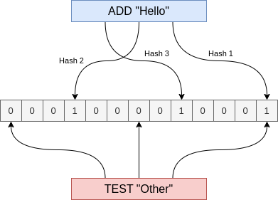

## Estruturas de dados probabilísicas

Estruturas de dados probabilísticas são estruturas de dados que respondem a consultas de maneira aproximada,
ou seja, com um grau de incerteza em vez de a resposta exata. A vantagem de uma esturutra desse tipo é que
as consultas respondem de forma muito mais rápida e ocupam menos espaço em memória/disco. Fazer o uso
de uma estrutura de dados desse tipo é uma troca: diminui a acurácia para ganhar velocidade de resposta e
reduzir espaço ocupado.

## Bloom Filter

Bloom filter foi criado em 1970 por Burton Howard Bloom. É uma estrutura de dados probabilística que responde
se um item faz parte de um conjunto de dados com um grau de incerteza, ou se definitivamente
o item não faz parte de um conjunto de dados. E faz isso de maneira eficiênte em relação ao espaço utilizado.

### Como funciona

Um _Bloom Filter_ faz uso de um **_bit array_ de um tamanho definido** e **múltiplas funções hash**. Cada
chave inseria é submetida às N funções hash. É utilizado o resultado dos 3 hashs para setar os bits
no array de bits. Com o array de bits configurado, temos como testar outras chaves contra o array, como exibido
na imagem abaixo.

Quando testada uma chave nova contra o array de bits, caso retorne todos os bits 1, a chave **pode** fazer
parte do conjunto de dados inseridos. Caso retorne algum bit 0, com certeza não faz parte do conjunto de dados.

Em alguns casos pode haver colisão de hash, ou seja, uma string testada retornar todos os bits 1 na consulta
sendo que ela não faz parte do conjunto de dados. Em outras palavras, a consulta pode retornar um falso positivo.

**A probabilidade de acontecer falso positivos vai depender do tamanho do array de bits e do número de
_hash functions_. Usar um array de bits maior vai ter menos chance de colisão, porém vai ocupar mais espaço. Já
ter mais hash functions, permite que o algoritmo seja mais preciso, porém tem um custo computacional para criar
e consultar as chaves. A recomendação é que se encontre um bom meio termo nessas parametrizações.**

### Implementação em Go

Em Go existe um pacote que implementa esse algoritmo chamado [bloom](https://github.com/bits-and-blooms/bloom).
Irei focar mais em como utilizá-lo pois ele possui alguns métodos interessantes que ajudam a escolher a parâmetrização,
e também métodos também de estimativa de rate de falso positivo, como mostrarei as seguir.
Caso queira ver como o algoritmo é feito basta acessar o repositório, o código é relativamente fácil de entender.

#### Utilização básica

Exemplo de utilização básica semelhante à ilustração acima, utilizando um array de bits de 10 com 3 hash functions.



#### Estimativa de parâmetros

#### Estimativa de falso positivos

## Cuckoo Filter

### Como funciona

### Implementação em Go

## Casos de uso

## Conclusão

### Referências

- Livro: Database Internals (Alex Petrov) - Página 147;
- https://www.geeksforgeeks.org/introduction-to-the-probabilistic-data-structure/
- https://redis.io/docs/data-types/probabilistic/bloom-filter/
- https://redis.io/docs/data-types/probabilistic/cuckoo-filter/
- https://www.cs.cmu.edu/~dga/papers/cuckoo-conext2014.pdf
- https://github.com/bits-and-blooms/bloom

#### Vídeos

- https://www.youtube.com/watch?v=V3pzxngeLqw&ab_channel=ByteByteGo
