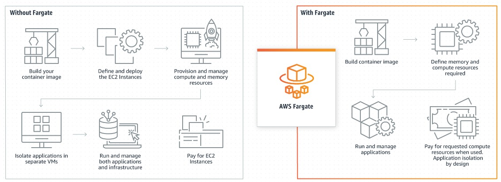
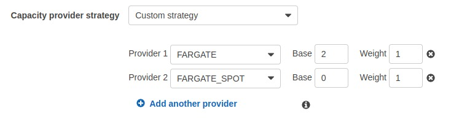
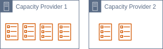
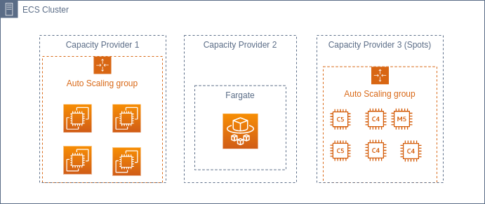

Você já utilizou o serviço ECS da AWS? Se já utilizou, possívelmente já conhece os capacity providers em algum nível e sabe como eles funcionam. Nesse post, vou explorar um pouco do que aprendi sobre eles e mostrar algumas coisas interessantes que são possíveis de implementar utilizando esse orquestrador de containers.

## O que é o Elastic Container Service (ECS)?

O ECS é um serviço gerenciado da AWS de orquestração de containers, ele é totalmente gerenciado e como todo serviço gerenciado tira muito da sobrecarga operacional.

Esse serviço é considerado mais simples que o EKS (Elastic Kubernetes Service). Embora seja mais simples de operacionalizar, ele não deixa de ser um serviço poderoso e que entrega diversas funcionalidades semelhantes as do EKS.

Dentro do contexto do ECS é importante conhecer bem a definição dos seus principais componentes:

- **Containers & Images**: As imagens dos containers são os componentes ou serviços que a aplicação precisa rodar em algum ambiente. Essas imagens precisam estar hospedadas em algum docker registry (Docker hub, ECR, Etc.);
- **Cluster**: É um agrupamento lógico de serviços e tarefas. Esse agrupamento serve para isolar os containers da aplicação. A infraestrutura que o cluster gerencia (seja serverless ou não) é responsável por botar os containers para rodar;
- **Tasks Definition**: É a especificação de um componente composto por um ou mais containers que fazem parte da sua aplicação;
- **Task**: É uma instância de uma task definition que devem ser rodadas pelo _cluster_. Fazendo uma analogia com POO, a _task definition_ é uma classe enquanto a task é um objeto;
- **Services**: Serviços são as tasks da aplicação que devem rodar continuamente, como uma API ou uma web application. Quando parados por algum motivo como erro ou algo do tipo eles são automaticamente iniciadas novamente pelo ECS.

Tá, e onde entram os capacity providers nesse esquema? Primeiro, temos que entender o que são os capacity providers e como funcionam.

## Como funcionam os capacity providers?

_Capacity provider_ a grosso modo é uma especificação de provisionamento da infraestrutura do cluster. Como o próprio nome sugere é a definição de como será criada a capacidade computacional que um cluster precisa para rodar as _Tasks_ e _Services_. Um cluster pode ter um ou mais de um _capacity provider_ e utilizá-los da meneira que atender melhor os objetivos da aplicação. (Vai ficar mais claro ao ver as estratégias de utilização dos capacity providers)

Quando você está criando um _capacity provider_, tem a opção de escolher um capacity provider Fargate ou EC2.

### EC2

No modelo utilizando instâncias EC2 você escolhe o(s) tipo(s) de instância(s) que você gostaria de utilizar e associa um autoscaling group com esse capacity provider. Normalmente é mais interessante utilizar o autoscaling que a própria amazon provisiona automaticamente na criação e recomenda utilizar e não configurar nada muito mirabolante, apenas fazer as configurações básicas das instâncias como AMI, família e etc.

### Fargate

Já com fargate, o gerenciamento de instâncias não é necessário. Com o Fargate você roda de maneira serverless as tasks e containers. Muito interessante se busca simplicidade, embora seja um pouco mais caro do que na utilização de instâncias EC2.

Com ele basta especificar a quantidade de memória e vCPU que a task ou serviço irá utilizar e mandar rodar e o próprio Fargate vai gerenciar as máquinas, mas para o usuário isso fica transparente.

### (Fargate | EC2) Spots

Em ambos os modelos, caso seja de interesse buscar uma economia de custos, é possível utilizar a versão Spot (EC2 Spot ou Fargate Spot).

O modelo _Spot_ tem a mesma ideia para as instâncias EC2 e para o Fargate. A aplicação/instância não tem garantia de continuidade da alocação dos recursos. Em determinado momento a instância - ou capacidade computacional no caso do fargate - pode ser requerido por outra conta e sua aplicação perder acesso aquele recurso.

Isso com certeza deve ser levado em conta e deve ser tratado, porém, na prática isso não acontece tão frequentemente a ponto de ser uma preocupação para as aplicações que não tem criticidade em relação a isso.

Uma coisa que é muito recomendado quando utiliza spot para as instâncias EC2 é que sejam selecionadas várias famílias de instâncias. Quanto mais famílias forem utilizadas, menor a chance de se ter uma interrupção do serviço que está rodando nesse modelo.

## Estratégias de utilização dos capacity providers

Dito tudo isso, agora vamos para o que interessa que são as estratégias de criação e como tirar proveito de um bom uso dos _capacity providers_.

**E é aqui que as coisas ficam realmente interessantes!**

Quando vai rodar uma task ou um service é possível utilizar uma estratégia de _capacity providers_. Essa estratégia pode ser a default configurada para o cluster ou então uma customizada especificamente para aquela task ou serviço.

### Definição de uma estratégia

Ao definir uma estratégia de _capacity providers_ você tem que escolher qual ou quais providers você quer utilizar e definir alguns parâmetros para cada _capacity provider_ caso seja selecionado mais de 1, e esses parâmetros são:

- **Base**: Que é o número de tasks que certamente vão ser utilizados no capacity provider configurado com Base > 0;
- **Weight**: O peso considerado para cada _capacity provider_ ao escolher onde rodar a task.

#### Exemplo

Considere uma estratégia que tenha 2 _capacity providers_ (CP1 e CP2) onde:

- CP1 tenha base 1 e weight 1
- CP2 tenha base 0 e weigth 1

Nesse cenário ao mandar rodar 6 tasks, as tasks serão provisionadas da seguinte forma:

- CP1: 4 tasks (task 1, 2, 4, 6)
- CP2: 3 tasks (task 3, 5, 7)

Ou seja, o peso é considerado depois que a base já foi preenchida e em caso de pesos iguais a ordem dos providers importa.

### Misturando provider Spot com provider On Demand

Sabendo como funcionam as estratégias dos CPs, é possível aproveitá-los ao máximo e criar estratégias que façam com que o custo possa ser reduzido misturando os deploys entre CPs on demand e CPs spot.

Vamos imaginar que criamos nosso cluster e temos 3 CPs disponíveis configurados para utilização, um on demand, um utilizando spot instances e o do fargate.

Nesse cenário, teria uma configuração que daria para fazer ao provisionar um service com 3 tasks por exemplo. Conseguiriamos colocar uma **base 3** e um weight 1 em cada CP, desta forma:

- Pelo menos 1 de cada uma das tasks do serviço estariam em um CP não spot;
- Ao escalar o serviço para ter 2 ou 3 tasks de cada como redundância ou balanceamento de carga, essas tasks poderiam ser espalhadas entre instâncias spots e instâncias do CP on Demand;

Dessa forma reduziria os custos e seria possível regular a quantidade de "risco" de ficar sem uma instância disponível através do peso utilizado no CP spot.

Outra utilidade interessante que pode ser feita considerando esse mesmo cluster, é rodar tarefas agendadas usando o CP do fargate ou fargate spot. As tasks tendem a ser provisionadas mais rapidamente no ambiente fargate, pois não tem chance de precisar criar uma instância EC2 nova para alocar a task.

### Spots Capacity provider (Indo além...)

Para ambientes menos críticos como de desenvolvimento, poderíamos ter uma estratégia de utilizar somente o CP de spot instances, aproveitando ao máximo o desconto que a AWS fornece nessa modalidade.

Ou então para ambientes temporários, seria possível utilizar esse modelo também. Como a containerização facilita o deploy de versões específicas, é possível subir uma aplicação em uma versão facilmente utilizando um cluster de desenvolvimento por exemplo.

---

Então dessa forma vimos como existem várias estratégias que são possíveis de criar para rodar os containers e alocar eles conforme a melhor necessidade e melhor encaixe para o caso de uso. Lembrando que tudo deve ser bem pensado e testado antes de colocar em produção.

## Informações adicionais

- É possível ter entre 0-10 capacity providers associados com um cluster;
- Na _task definition_ precisa ser selecionado a compatibilidade com o fargate/ec2 launch type e ela tem que ser compatível com o tipo do capacity provider;
- A interface nova no console da AWS não tem uma maneira de gerenciar os capacity providers direito ainda (nesse momento de escrita), tem que ser utilizada a versão antiga, através da CLI ou através de IAC.

## Conclusão

As aplicações estão em constante evolução e a containerização de aplicação já é uma realidade há algum tempo. Saber aproveitar os recursos da AWS da melhor maneira possível tem um grande valor para as empresas, e os capacity providers são uma peça importante para quem utiliza o serviço ECS da AWS ou aplicações containerizadas. Além disso aproveitar as opções de provisionamento da melhor forma possível permite uma redução de custos significativa e faz com que seus custos com AWS sejam otimizados.

### Referências

- https://aws.amazon.com/pt/ecs/
- https://docs.aws.amazon.com/AmazonECS/latest/developerguide/cluster-capacity-providers.html
- https://aws.amazon.com/pt/blogs/containers/deep-dive-on-amazon-ecs-cluster-auto-scaling/
- https://docs.aws.amazon.com/AmazonECS/latest/developerguide/welcome-features.html

Apresentações por Adam Keller e Amazon:

- https://www.youtube.com/watch?v=Fb1EwgfLbZA
- https://www.youtube.com/watch?v=Vb_4wAEcfpQ
