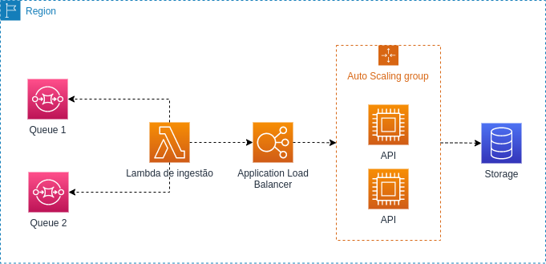

Recentemente precisei implementar uma funcionalidade onde uma lambda
consumia as mensagens de uma fila SQS, transformava os dados e fazia uma
requisição para o _endpoint_ correto com base na mensagem recebida e suas configurações.

O cenário base era algo semelhante ao da imagem a seguir:



É a partir desse cenário que vou mostrar o problema _poison pill_ e como resolvê-lo.

## Problema (Poison Pill)

O processamento das mensagens pela lambda é feito através de polling. Ou seja,
a lambda faz uma requisição para receber as mensagens da fila. É comum receber as
mensagens da fila em lotes, para que sejam necessárias fazer menos invocações da lambda
e também que gaste menos com requisições feitas para o SQS.

O problema nesse caso acontece caso haja uma falha no meio desse lote de mensagens.
Caso ocorra erro em 1 única mensagem, o lote inteiro pode ser invalidado e terá que ser reprocessado.
Essa mensagem chamamos de **_poison pill_**.

## Solução

Para solucionar esse tipo de problema nessa integração lambda+sqs, a AWS implementou uma maneira
de indicar quais mensagens tiveram sucesso e quais tiveram falhas no meio do lote das mensagens.
Isso é feito retornando o um objeto com o campo **_BatchItemFailures_**, junto com as mensagens
que deram problema.

Um exemplo de implementação em Go segue uma estrutura semelhante a essa:

```go
package main

import (
	"context"
	"encoding/json"
	"fmt"
	"log"
	"math/rand"
	"time"

	"github.com/aws/aws-lambda-go/events"
	"github.com/aws/aws-lambda-go/lambda"
)

type MessageFailure struct {
	ItemIdentifier string `json:"itemIdentifier"`
}

type BatchItemFailures struct {
	BatchItemFailures []MessageFailure `json:"batchItemFailures"`
}

func handler(ctx context.Context, event events.SQSEvent) (string, error) {
	var failures BatchItemFailures

	for _, message := range event.Records {
		// Simulação de um processamento
		fmt.Println("Processing message:", message.Body)
		time.Sleep(200 * time.Millisecond)

		if rand.Intn(10) < 2 {
			fmt.Println("Failed", message.MessageId)

			failure := MessageFailure{ItemIdentifier: message.MessageId}
			failures.BatchItemFailures = append(
				failures.BatchItemFailures,
				failure,
			)
		}
	}

	response, err := json.Marshal(failures)
	if err != nil {
		log.Fatal("Error marshaling BatchItemFailures")
	}

	fmt.Println("Total failed", len(failures.BatchItemFailures))
	fmt.Println("Response", string(response))

	// Apenas as mensagens falhadas voltarão para a fila para serem reprocessadas
	return string(response), nil
}

func main() {
	lambda.Start(handler)
}
```

Nesse exemplo, tem adicionei a simulação de um erro com 20% de chance
de ocorrer no processamento com `rand.Intn(10) < 2`. Nesse caso, eventualmente
ocorreria um erro na lambda e apenas as mensagens que deram erro voltam para a fila.
As outras mensagens são deletadas e são consideradas sucesso.
**Reparem que o ID da mensagem é retornado dentro do item do batchItemFailure**
e é através dele que sabe-se que uma mensagem foi processada com sucesso ou não.

**Um ponto bastante importante** dessa configuração é que deve ser configurado o parâmetro
`function-response-types` para "ReportBatchItemFailures". Essa configuração, até o momento do post
não é possível fazer pelo console da AWS. Somente pela CLI, e o comando é o seguinte:

```
aws lambda update-event-source-mapping \
  --function-response-types "ReportBatchItemFailures" \
  --uuid lambdaID
```

Nos exemplos de código,

## Exemplo de implementação completo

Implementei um terraform para subir uma estrutura como essa descrita no post
com esse mesmo código da lambda. Caso tenha curiosidade e queira rodar, ele está localizado
no link https://github.com/leometzger/leometzger.github.io-code-examples/tree/main/lambda-sqs-partial-return.

Como rodar o template do terraform não é o objetivo desse post. Como rodar o exemplo está descrito
no código do repositório. Caso queira reproduzir o mesmo exemplo, sintam-se a vontade.

## Conclusão

A utilização do **_batchItemFailures_** é bastante útil e pode gerar uma boa redução de custo no cenário onde
a lambda é invocada muitas vezes e ocorra algumas falhas eventuais. Além disso, permite que você evite
de gastar com processamento e reenvio dos dados caso não seja necessário. Também habilita a possibilidade
de usar sempre o processamento em lotes na lambda, podendo melhorar o desempenho do sistema como um todo.

## Referências

- https://aws.amazon.com/pt/about-aws/whats-new/2021/11/aws-lambda-partial-batch-response-sqs-event-source/
- https://aws.amazon.com/pt/premiumsupport/knowledge-center/lambda-sqs-report-batch-item-failures/
