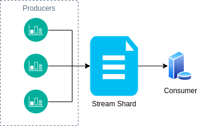
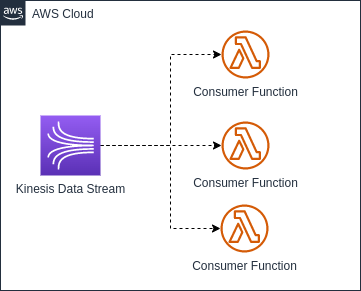

Nos últimos dias estive trabalhando e testando o Kinesis, durante esse período aprendi e testei algumas algumas coisas com ele. Esse post é uma compilação do básico sobre Kinesis, maneiras de utilizá-lo e alguns dos aprendizados que tive ao utilizar essa ferramenta.

## O que é o AWS Kinesis?

Kinesis é um conjunto de serviços da AWS que facilita a coleta, permite fazer processamento e análise dos dados de _streaming_ em tempo real. Os serviços disponibilizados são:

- **Kinesis Data Streams**;
- Kinesis Video Streams;
- Kinesis Data Firehose;
- Kinesis Data Analytics.

O foco desse post é explorar o **Kinesis Data Stream** dentre esses serviços.

### Kinesis Data Streams

O Kinesis Data _stream_ é um serviço de _stream_ de dados gerenciado. Ele permite que você faça transmissões de multiplos Gb/s de dados através dele.

### Para que ele serve?

Se você tem um cenário em que de alguma forma você coleta dados de maneira contínua de dados e precisa que esses dados sejam processados ele pode ser útil. Alguns casos de uso são:

- Métricas de aplicação;
- _Internet of things (IoT)_;
- _Clickstreams_ de usuário;
- _Big data_ em tempo real;
- _Tracking_ de localização.

Todos esses casos de uso costumam ter a necessidade de transmitir dados de maneira contínua. Para esses casos e outros semelhantes, o Kinesis Data _stream_ deve ser considerado como uma das opções de solução.

### Diferença entre Kinesis e SQS

Uma dúvida que pode surgir quando está se começando a utilizar kinesis é: Devo utilizar Kinesis ou SQS para esse meu caso de uso?

A seguinte tabela ajuda a diferenciar melhor os dois:

| -                                    | SQS             | Kinesis Data _stream_ |
| ------------------------------------ | --------------- | --------------------- |
| Tamanho do registro                  | Até 256KB       | Até 1MB               |
| Replay                               | Não é possível  | Possível              |
| Necessidade de configurar throughput | Sem necessidade | Necessário            |
| Throughput máximo                    | Sem limitação   | 1 MB/s por shard      |
| Garantia de ordenação                | Sem garantia    | Ordenado por shard    |
| Delay de mensagens                   | Possui          | Não possui            |

O cerne da diferença é que o Kinesis deve ser utilizado para transmissão e processamento de dados em larga escala e/ou em tempo real. E a SQS é para enfileirar trabalhos para serem feitos de maneira assíncrona, ou transmitir mensagens para integração de sistemas.

## Kinesis Data Stream

Mas afinal de contas, o que é uma data _stream_ e como ela funciona. Criei uma analogia que facilitou meu entendimento de como funciona o a _data stream_.

Podemos imaginar que uma _stream_ de dados é um super arquivo em que o produtor (quem gera os dados) vai escrevendo nesse super arquivo e o consumidor vai ler esse arquivo utilizando alguma estratégia, seja lendo do início, a partir de um determinado ponto ou então somente o que está entrando novo nele para fazer o processamento.

Além disso, caso haja necessidade, seria possível ter mais de um desses "super arquivos", o que no contexto do data _stream_ chamamos de **_Shards_**.

### Shards

Os _shards_ são segmentações dos registros escritos. No Kinesis cada _shard_ tem o _throughput_ máximo de 1 MB/s para escrita e 2 MB/s para leitura. Então, seguindo a analogia, cada super arquivo teria a capacidade de armazenar até 86,4 GB escritos em um rate de 1 MB/s e é possível ler 172,8 GB em um rate de 2 MB/s.

É praticamente impossível manter o rate exato máximo exato, mas esse exemplo ilustra a capacidade máxima de um _shard_ da _stream_ e sempre que possível é importante deixar mais próximo considerando uma margem de segurança para _bursts_, tendo assim um melhor aproveitamento da _stream_.

## Producers

Os producers no contexto do Kinesis são os responsáveis por enviar os dados para a _stream_ do Kinesis. São eles que de alguma forma estão coletando os dados. Eles agem como sensores e enviando para a _stream_ para então os dados serem processados pelo consumidor.

Existem 3 principais formas de criar um producer no Kinesis, que são:

- Através da SDK;
- Usando o Kinesis Agent
- Através da Kinesis Producer Library (KPL).

### SDK

Utilizando a SDK é a implementação mais manual, porém bem simples. Basta enviar os dados junto a uma `PartitionKey`. A `PartitionKey` é utilizada para definir para qual _shard_ aquele registro será enviado.



### Kinesis Agent

Já o Kinesis Agent é uma aplicação java que fornece uma maneira fácil de enviar dados para a _stream_. O agente por si só já faz o controle de como enviar os dados para a _stream_, utiliza mecanismos de retentativa. Basta configurá-lo em alguma instância e aplicar as configurações e após configurado ele envia os dados dos arquivos para a _stream_ de maneira resiliente.

Através das configurações é possível indicar os padrões de qual é o terminador para truncar os registros, configurações de _buffer_, padrões de arquivo, posição e início, entre outras.

### Kinesis Producer Library (KPL)

A outra alternativa é utilizar a KPL, que é uma biblioteca escrita em C++ e que possui um pacote _wrapper_ Java. Ela age como um _middleware_ entre o seu _producer_ e a _stream_, facilitando implementar a ingestão de dados para o Kinesis de maneira resiliente. Ela tem mecanismos _built in_ que ajudam a evitar a necessidade de reescrever código, deixam a ingestão mais performática, aumentando o _throughput_ e criando um monitoramento de maneira integrada.

Além disso, ela integra muito bem com a solução quando utilizada em conjunto com a KCL. A grande desvantagem é que ela não tem _wrapper_ suportado pela AWS para outras linguagens.

## Consumers

Os _consumers_ por outro lado, são os responsáveis por ler os dados da _stream_ e executar os processos do sistema em cima dos dados. Assim como para os _producers_, existem diferentes formas de implementar os _consumers_, que são:

- Lambda Functions;
- Worker + SDK;
- Kinesis Client Library (KCL).

O Kinesis Firehose e Kinesis Analytics são tipos consumidores também, porém estão fora do escopo desse post (talvez em algum outro momento).

### Lambda Functions

A maneira mais simples de implementar um _consumer_ pode ser através de uma Lambda Function. Esse tipo de _consumer_ é implementado de maneira muito parecido com a SQS+Lambda.

A ligação da Lambda com o Kinesis é feita através de um _trigger_ de _event source_. Nós podemos configurar alguns parâmetros para o _event source_ para termos mais controle de como e quando essa Lambda é invocada.

Lembrando que a Lambda precisa de permissão para acessar e consumir a _stream_. Essa permissão pode ser dada através da política gerenciada **AWSLambdaKinesisExecutionRole**.

#### Event Source Parameters

Os principais parâmetros dessa integração são os seguintes:

- **Batch size**: Quantidade de mensagens agrupadas antes de invocar a Lambda;
- **Batch window**: Tempo de espera ao agregar o batch para invocação da Lambda;
- **On-failure destination**: Envio de mensagens que ocorreram erro (_Dead Letter Queue_);
- **Retry attempts**: Quantidade de retentativas antes de enviar para a DLQ;
- **Maximum age of records**: Idade máxima do registro mais antigo da _stream_ que deve ser processado;
- **Concurrent batches per shard**: Quantidade de Lambdas podendo rodar de maneira concorrente;
- **Split batch on error**: _Flag_ para indicar que o retorno indicará somente os registros que falharam pelo ID. Funciona para evitar o problema de [poison pill](https://leometzger.github.io/p/lambda-sqs-partial-return/).

Um parâmetro que vale destacar é o **_Starting Position_**, que define a estratégia de onde a Lambda vai começar a processar a _stream_, as opções são as seguintes:

- **AT_TIMESTAMP**: Começa a processar a partir de um _timestamp_ fixo;
- **TRIM_HORIZON**: Ao ativar a Lambda começa a processar os registros a partir do início da _stream_ (registro mais antigo);
- **LATEST**: Ao ativar a Lambda começa a processar somente os registros novos que estão entrando na _stream_.

### Worker + SDK

A segunda maneira de implementar o consumo de uma _stream_ é utilizando um _worker_ (container docker na imagem de exemplo), que vai ler os registros da _stream_ através da SDK.

Para esse modelo, é importante ter algum tipo de mecanismo de controle e gerenciamento. Os controles são recomendados para deixar a aplicação mais resiliente e tolerante a falhas. No exemplo da imagem está considerado que será utilizado o DynamoDB com auxilio para gerenciar esse controle, porém, pode ser utilizado alguma outra fonte de armazenamento de dados. Algumas coisas importantes para serem gerenciadas pela aplicação são as seguintes:

- Controle para cada _worker_ ler de um _shard_ diferente para evitar processamento duplicado;
- Tratamento para _autoscaling_ para mais _workers_ ou menos _workers_ com base na quantidade de _shards_ disponíveis;
- Checkpointing, ou seja, ir salvando até qual o _sequence number_ que já foi processado na _stream_;
- Re-tentativas.

Um exemplo de implementação simples, sem considerar nenhum tipo de controle pode ser implementado da seguinte forma:



### Kinesis Client Library (KCL)

A KCL assim como a KPL é um processo que age como um meio de campo entre o _consumer_ e o _shard_ do Kinesis. Esse processo pode ser configurado e faz os diferentes controles citados acima, o que facilita deixar a implementação mais resiliente. Porém, ao terceirizar o controle para a ferramenta, temos menos opções de customização.

A KCL além de integrar muito bem com a KPL ainda tem projetos que servem portas para outras linguagens de programação além do Java. Apesar de em Go não ter esse projeto que utiliza o processo do KCL, exitem algumas bibliotecas _open source_ que fazem algo parecido com a KCL. Os projetos que a AWS mantem hoje são:

- https://github.com/awslabs/amazon-kinesis-client - Padrão (Java);
- https://github.com/awslabs/amazon-kinesis-client-nodejs - Node
- https://github.com/awslabs/amazon-kinesis-client-python - Python
- https://github.com/awslabs/amazon-kinesis-client-ruby - Ruby
- https://github.com/awslabs/amazon-kinesis-client-net - .NET

Implementei um exemplo utilizando a KCL (kcl-with-node), caso alguém tenha curiosidade em saber como implementar. Existem algumas especificidades para criar e configurar esse projeto. Devo fazer um post focado na KCL para abordar essas especificidades.

## Fan-Out Consumers

_Fan-Out consumers_ é uma funcionalidade da _stream_ que permite aumentar o _throughput_ de leitura da _stream_. O que essa opção faz é permitir o _throughput_ de 2 MB/s por _shard_ por _consumer_. Então, caso sua aplicação tenha mais de 1 _consumer_, o _throughput_ do _shard_ da _stream_ não é compartilhado e sim segmentado por _consumer_. Porém, habilitando essa funcionalidade da _stream_ o seu custo aumenta. Então, deve ser utilizado somente caso necessário.

Habilitar ou não essa funcionalidade vai depender do tipo de aplicação que se está implementando e da arquitetura que o sistema tem.

## Limites de API

Existem alguns limites do _Data Plane_ que temos que ficar atentos ao utilizar o Kinesis Data _stream_ para não receber nenhum tipo de _ThroughputException_. Todos os limites a seguir

| API              | Limite            | Descrição                                                                  |
| ---------------- | ----------------- | -------------------------------------------------------------------------- |
| GetShardIterator | 5 TPS             | Pode buscar o iterador no máximo 5x por segundo                            |
| GetRecords       | 5 TPS             | Pode chamar o batch mensagens no máximo 5x por segundo                     |
| PutRecord        | 1000 TPS ou 1MB/s | Pode enviar no máximo 1000 registros por segundo caso o registro tenha 1kb |
| PutRecords       |                   | Segue o mesmo limite do PutRecord, só que agrupado                         |

## Conclusão

O Kinesis é uma ferramenta excelente se você está precisando fazer a transmissão de grandes quantidade de dados. Tem muita aderência com projetos IoT e monitoramentos em geral, onde os _producers_ enviam dados constantemente para a aplicação. Hoje existem algumas alternativas, porém acho uma excelente ferramenta para se ter conhecimento, além disso ela integra facilmente com outros serviços AWS.

### Repositórios de exemplos completos

- https://github.com/leometzger/leometzger.github.io-code-examples/tree/main/using-kinesis
- https://github.com/leometzger/kcl-with-node

### Referências

- https://github.com/awslabs/amazon-kinesis-producer
- https://docs.aws.amazon.com/streams/latest/dev/kinesis-kpl-supported-plats.html
- https://docs.aws.amazon.com/lambda/latest/dg/with-kinesis.html#events-kinesis-permissions
- https://aws.amazon.com/pt/kinesis/data-streams/
- https://docs.aws.amazon.com/streams/latest/dev/writing-with-agents.html
- https://docs.aws.amazon.com/streams/latest/dev/service-sizes-and-limits.html
