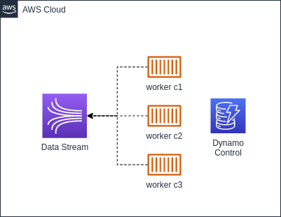

Nos últimos dias estive trabalhando com Kinesis, durante esse período
aprendi e testei algumas algumas coisas com ele. Esse post é uma compilação
do básico sobre Kinesis, maneiras de utilizá-lo e alguns dos aprendizados que tive
ao utilizar essa ferramenta.

## O que é o AWS Kinesis?

Kinesis é um conjunto de serviços da AWS que facilita a coleta, permite fazer processamento e análise dos dados de streaming em tempo real. Os serviços disponibilizados são:

- **Kinesis Data Streams**;
- Kinesis Video Streams;
- Kinesis Data Firehose;
- Kinesis Data Analytics.

O foco desse post é explorar o **Kinesis Data Stream** dentre esses serviços.

### Kinesis Data Streams

O Kinesis Data Stream é um serviço de stream de dados gerenciado. Ele permite que você faça transmissões de multiplos Gb/s de dados através dele.

### Pra que que ele serve?

Se você tem um cenário em que de alguma forma você coleta dados de maneira contínua de dados e precisa que esses dados sejam processados ele pode ser útil. Alguns casos de uso são:

- Métricas de aplicação;
- _Internet of things (IoT)_;
- _Clickstreams_ de usuário;
- _Big data_ em tempo real;
- _Tracking_ de localização.

Todos esses casos de uso costumam ter a necessidade de transmitir dados de maneira contínua. Para esses casos e outros semelhantes, o Kinesis Data Stream deve ser considerado como uma das opções de solução.

### Diferença entre Kinesis e SQS

Uma dúvida que pode surgir quando está se começando a utilizar kinesis é: Devo utilizar Kinesis ou SQS para esse meu caso de uso?

A seguinte tabela ajuda a diferenciar melhor os dois:

| -   | SQS | Kinesis Data Stream |
| --- | --- | ------------------- |
| a   | v1  | v2                  |

O cerne da diferença é que o Kinesis deve ser utilizado para transmissão e processamento de dados em larga escala e/ou em tempo real. E a SQS é para enfileirar trabalhos para serem feitos de maneira assíncrona.

## A Data Stream

Mas afinal de contas, o que é uma data stream e como ela funciona. Criei uma analogia que facilitou meu entendimento de como funciona o a data stream.

Podemos imaginar que uma stream de dados é um super arquivo em que o produtor (quem gera os dados) vai escrevendo nesse super arquivo e o consumidor vai ler esse arquivo utilizando alguma estratégia, seja lendo do início, a partir de um determinado ponto ou então somente o que está entrando novo nele para fazer o processamento.

Além disso, caso haja necessidade, seria possível ter mais de um desses "super arquivos", o que no contexto do data stream chamamos de **Shards**.

### Shards (Kinesis)

Os shards são segmentações dos registros escritos. No Kinesis cada shard tem o throughput máximos de 1 MB/s para escrita e 2 MB/s para leitura. Então, seguindo a analogia, cada super arquivo teria a capacidade de armazenar até 86,4 GB escritos em um rate de 1 MB/s e é possível ler 172,8 GB em um rate de 2 MB/s.

É praticamente impossível manter o rate exato máximo exato, mas esse exemplo ilustra a capacidade máxima de um shard da stream e sempre que possível é importante deixar mais próximo considerando uma margem de segurança para _bursts_, tendo assim a melhor utilização da stream.

## Producers

Os producers no contexto do Kinesis são os responsáveis por enviar os dados para a stream do kinesis. São eles que de alguma forma estão coletando os dados. Eles agem como sensores e enviando para a stream para então os dados serem processados pelo consumidor.

Existem 3 principais formas de criar um producer no Kinesis, que são:

- Através da SDK;
- Usando o Kinesis Agent
- Através da Kinesis Producer Library (KPL).

### SDK

Utilizando a SDK é a implementação mais manual, porém bem simples. Basta enviar os dados junto a uma partitionKey. A partition key é utilizada para definir para qual shard aquele registro será enviado.



### Kinesis Agent

Já o Kinesis Agent é uma aplicação java que fornece uma maneira fácil de enviar dados para a stream. O agente por si só já faz o controle de como enviar os dados para a stream, utiliza mecanismos de retry. Basta configurá-lo em alguma instância e aplicar as configurações e após configurado ele envia os dados dos arquivos para a stream de maneira resiliente.

Através das configurações é possível indicar os padrões de qual é o terminador para truncar os registros, configurações de buffer, padrões de arquivo, posição e início, buffer, entre outras.

### Kinesis Producer Library (KPL)

A outra alternativa é utilizar a KPL, que é uma biblioteca escrita em C++ e que possui um pacote _wrapper_ Java. Ela age como um middleware entre o seu producer e a stream, facilitando implementar a ingestão de dados para o Kinesis de maneira resiliente. Ela tem mecanismos _built in_ que ajudam a evitar a necessidade de reescrever código, deixam a ingestão mais performática, aumentam o _throughput_ e tem um monitoramento próprio nela.

Além disso, ela integra muito bem com a solução quando utilizada em conjunto com a KCL. A grande desvantagem é que ela não tem wrapper suportado pela aws para outras linguagens.

## Consumers

Os _consumers_ por outro lado, são os responsáveis por ler os dados da stream e executar os processos do sistema em cima dos dados. Assim como para os _producers_, existem diferentes formas de implementar os _consumers_, que são:

- Lambda Functions;
- Worker + SDK;
- Kinesis Client Library (KCL).

O Kinesis Firehose e Kinesis Analytics são tipos consumidores também, porém estão fora do escopo desse post (talvez em algum outro momento).

### Lambda Functions

A maneira mais simples de implementar um consumer pode ser através de uma lambda function. Esse tipo de consumer é implementado de maneira muito parecido com a SQS+Lambda.

A ligação da lambda com o Kinesis é feita através de um _trigger_ de _event source_. Nós podemos configurar alguns parâmetros para o event source para termos mais controle de como e quando essa lambda é invocada.

Lembrando que a lambda precisa de permissão para acessar e consumir a stream. Essa permissão pode ser dada através da política gerenciada **AWSLambdaKinesisExecutionRole**.

#### Event Source Parameters

Os principais parâmetros dessa integração são os seguintes:

- **Batch size**: Quantidade de mensagens agrupadas antes de invocar a lambda;
- **Batch window**: Tempo de espera ao agregar o batch para invocação da lambda;
- **On-failure destination**: Envio de mensagens que ocorreram erro (_Dead Letter Queue_);
- **Retry attempts**: Quantidade de retries antes de enviar para a DLQ;
- **Maximum age of records**: Idade máxima do registro mais antigo da stream que deve ser processado;
- **Concurrent batches per shard**: Quantidade de lambdas podendo rodar de maneira concorrente
- **Split batch on error**: Flag para indicar que o retorno indicará somente os registros que falharam pelo ID. Funciona para evitar o problema de [poison pill](https://leometzger.github.io/p/lambda-sqs-partial-return/).

Um parâmetro que vale destacar é o **_Starting Position_**, que define a estratégia de onde a lambda vai começar a processar a stream, as opções são as seguintes:

- **AT_TIMESTAMP**: Começa a processar a partir de um timestamp fixo;
- **TRIM_HORIZON**: Ao ativar a lambda começa a processar os registros a partir do início da stream (registro mais antigo);
- **LATEST**: Ao ativar a lambda começa a processar somente os registros novos que estão entrando na stream.

### Worker + SDK

A segunda maneira de implementar o consumo de uma stream é utilizando um worker (container docker na imagem), que vai ler os registros da stream através da SDK.

Para esse modelo, é importante ter algum tipo de mecanismo de controle e gerenciamento. Os controles são recomendados para deixar a aplicação mais resiliente. No exemplo da imagem está considerado que será utilizado o DynamoDB com auxilio para gerenciar esse controle, porém, pode ser utilizado alguma outra fonte de armazenamento de dados. Algumas coisas importantes para serem gerenciadas pela aplicação são as seguintes:

- Controle para cada worker ler de um shard diferente;
- Tratamento para _autoscaling_ para mais workers ou menos workers com base na quantidade de shards disponíveis;
- Checkpointing, ou seja, ir salvando até qual o _sequence number_ que já foi processado na stream;
- Re-tentativas.

Um exemplo de implementação simples, sem considerar nenhum tipo de controle pode ser implementado da seguinte forma:



### Kinesis Client Library (KCL)

## Fan-Out Consumers

## Limites

## Conclusão

### Referências

- https://github.com/awslabs/amazon-kinesis-producer
- https://docs.aws.amazon.com/streams/latest/dev/kinesis-kpl-supported-plats.html
- https://docs.aws.amazon.com/lambda/latest/dg/with-kinesis.html#events-kinesis-permissions
- https://aws.amazon.com/pt/kinesis/data-streams/
- https://docs.aws.amazon.com/streams/latest/dev/writing-with-agents.html
- https://docs.aws.amazon.com/streams/latest/dev/service-sizes-and-limits.html
